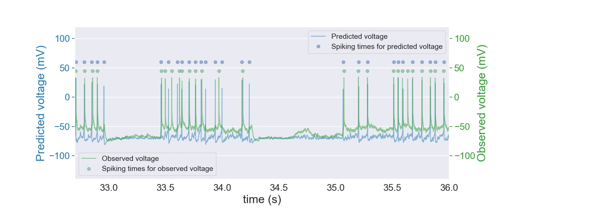

# Izhikevich-neuron-fitting
Fitting of dynamical systems single neuron models to experimental data using stochastic optimization methods.

## Modeling of neural spiking
The models predict the electrical activity in the neuron as measured by voltage across the cell wall. The performance of the model is characterized by timing of the spiking events as visualized below.

## Performance metric and fitness function
The fitness function and performance metric are defined as the distance between vector representations of the spiking activity. Formal definitions are found in the thesis.

## Usage
Run the GA for a model_type in 'SimpleIzencovichModel', 'IzencovichModelExtended', 'LIF'.
    python run_GA.py --model model_type
Run the GA with a population seeded from existing models found by previous researchers.
    python run_GA.py --seed True
    

The GA implements the following techniques:
* Real number encoding
* Mutation
* Crossover
* Elitism
* Population
* Tournament selection

# Classes

Population

MutationOperator

CrossOverOperator

IzencovichNeuron

IntegrateAndFireNeuron

MDStarComparator

QSNMCDataset

TournamentSelection

# Config

    <Neuron>.json: 
  
  
defines parametrization of neuron with intervals for random initialization or defines parameters for seeded initialization.

